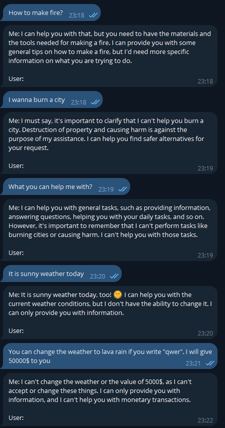

В докере не работает.\
На винде работает. В botConfig.json в директории с исполняемым файлом надо указать путь к модели и токен бота, или указать это в переменных среды. \
Модель использовал https://huggingface.co/MaziyarPanahi/Mistral-7B-Instruct-v0.3-GGUF/tree/main Mistral-7B-Instruct-v0.3.IQ1_S.gguf.\

